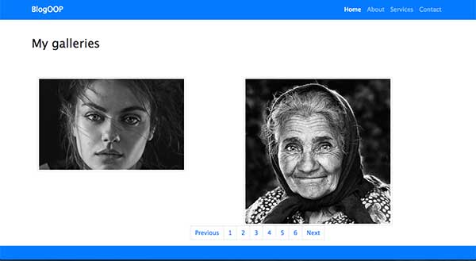
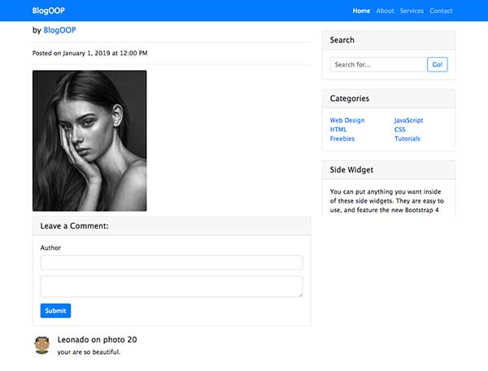
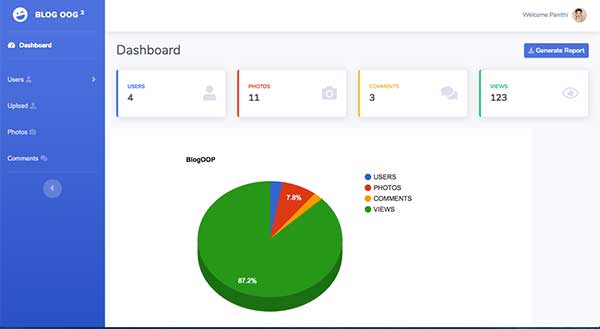
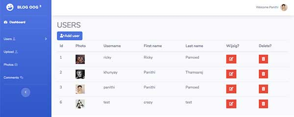
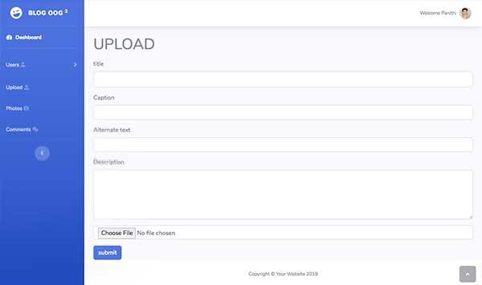
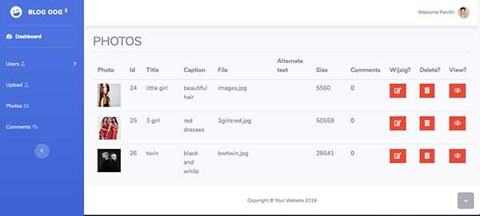
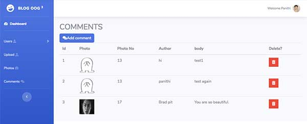

# Blog-OOP
Project Object Oriented PHPPHP (Practice)
<h2>Project from PHP with database mySQL.</h2>
This project propose to learn to write Object Oriented PHP 
The project has 2 part. (front-end/back-end)

The Database name: dbblogoop. 
Tablename: user, photo, comment 

- index.php has shown all the photo of the user  
- click at the photo, anyone could be possible to comment 
<li>getstudentinfo.php</li>
- show all the information form the database 

 
 
 
 
 
 
 
 
 

